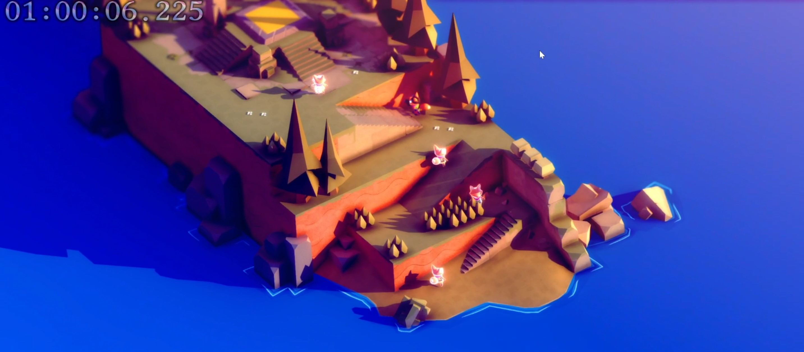

# Tunic Replay

Capture and replay Tunic runs as a "ghost" for speedrun practice.

## Components

This project consists of 2 separate components:

1. LiveSplit auto-splitter to capture a replay file
2. TUNIC BepInEx plugin to display the ghosts of the replay files

Instructions and license for each component can be found with the respective
component.
